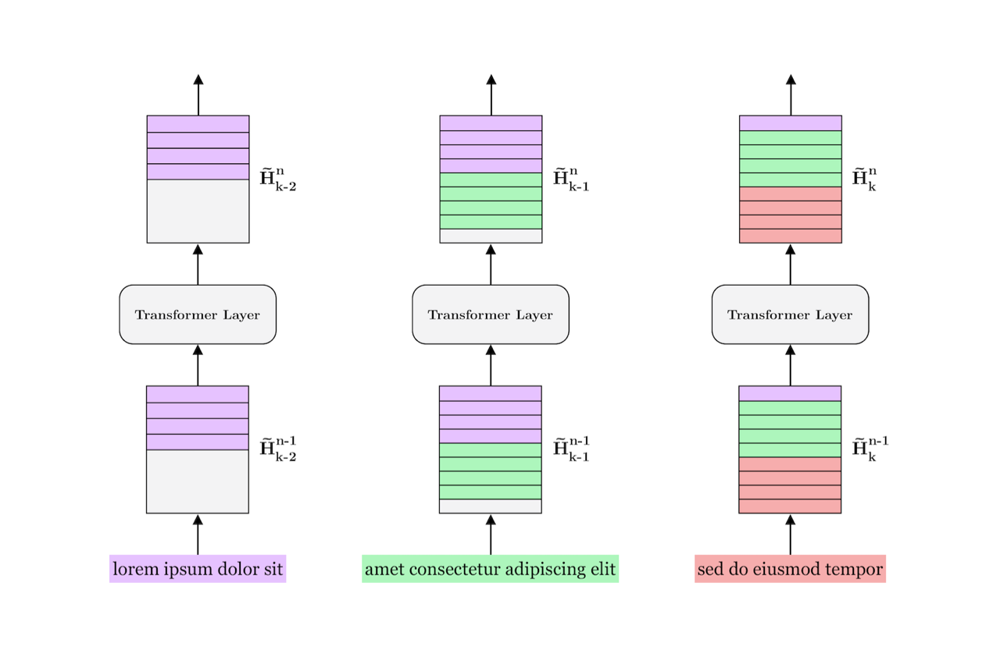

# Transformer-XL



This repo is associated with the blog post ["Transformer-XL: A Memory-Augmented Transformer"](https://sigmoidprime.com/post/transformer-xl) over at [sigmoid prime](https://sigmoidprime.com/). It contains a lightweight implementation of the Transformer-XL architecture, proposed by Dai et al. in the paper ["Transformer-XL: Attentive Language Models Beyond a Fixed-Length Context"](https://arxiv.org/abs/1901.02860) (2019).

Inspired by Andrej Karpthy's [minGPT](https://github.com/karpathy/minGPT), the implementation focuses on simplicity by distilling the architecture to its bare minimum, so you won't find any code for training the model on large text corpuses or anything like that. Like minGPT, the implementation only comes with a script to train the model to sort sequences of unordered numbers. To do that, simply run:

```
python3 transformer-xl/train.py
```

followed by the command below to evaluate the trained model.

```
python3 transformer-xl/eval.py
```

The `eval.py` script will evaluate the model with and without the "memory-augmentation" proposed by Dai et al. Depending on how long you set the sequence length and memory length, you should see the memory-augmented version perform significantly faster than the memory-free model.
